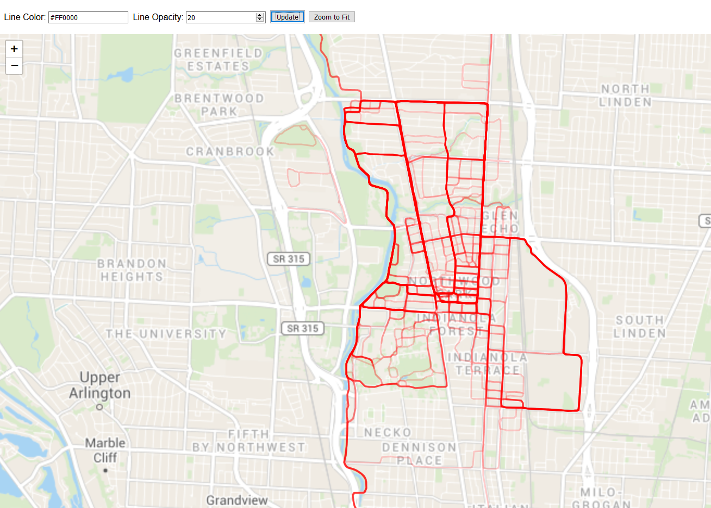

# Heatmap

View a map with TCX and GPX files overlayed on it.



## How to use

1. First, place all the .tcx and .gpx files in a folder within this directory called `input`.

2. Next, get an API token from [Thunderforest](https://www.thunderforest.com/) by signing up for a free account. In `plot.js`, replace `{YOUR_API_TOKEN}` with your API token. Alternatively, you can use any other free or paid tile server, just be sure to replace `tileUrlTemplate` and `tileAttribution` in `plot.js`

3. Then, ensure you have [cargo and rust installed](https://www.rust-lang.org/tools/install). Then, in this directory, run
    ```
    cargo run --release
    ```

    This will read each of the GPX and TCX files and convert them to data that can be plotted on a map. After this process has completed, open `index.html` in a browser to view your map.
